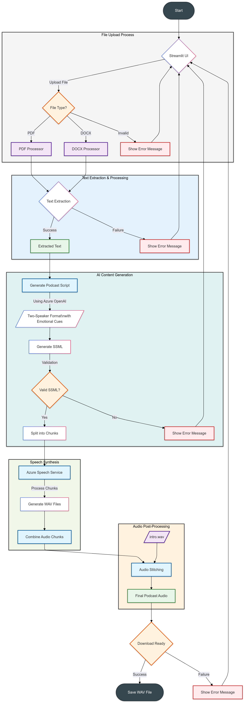

# Azure-Powered Podcast Generator



Listen to an example <a href="https://microsofteur-my.sharepoint.com/:u:/g/personal/naghazal_microsoft_com/EWDoyr23Y35JtwAIAnCRlTQBFggVlBLKgdcKvRqHJPDH9w?e=dVabys" target="_blank">HERE</a>

An end-to-end solution for converting document content into professional podcast episodes using Azure AI services. Automates script generation, emotional speech synthesis, and audio production.

## Features

- **Document Processing**: Extract text from PDF/DOCX files
- **AI Script Writing**: GPT powered podcast script generation with emotional cues
- **Voice Synthesis**: Azure Neural Voices with microscopic prosody adjustments
- **Audio Production**: SSML-based audio generation with conversation dynamics
- **Streamlit UI**: User-friendly interface for content processing

## Prerequisites

1. **Azure Services**:
   - Azure OpenAI Service
   - Azure Speech Service
   - Azure Document Intelligence
   
2. **Python 3.10+**
3. **FFmpeg** (for audio processing)
4. **Environment Variables** (store in `.env` file)

## Installation

```bash
git clone https://github.com/yourusername/podcast-generator.git
cd podcast-generator
pip install -r requirements.txt
```

## Configuration

Create `.env` file with your Azure credentials:
```env
# OpenAI
OPENAI_ENDPOINT=your_azure_openai_endpoint
OPENAI_KEY=your_azure_openai_key
OPENAI_API_VERSION=your_azure_openai_model_version
OPENAI_MODEL=your_model

# Speech Service
SPEECH_KEY=your_speech_key
SPEECH_REGION=your_region

# Document Intelligence
DOCUMENT_INTELLIGENCE_KEY=your_key
DOCUMENT_INTELLIGENCE_ENDPOINT=your_endpoint
```

## Usage

1. Start the Streamlit app:
```bash
streamlit run podcast.py
```

2. In the web interface:
   - Upload a PDF/DOCX file
   - Wait for processing (script generation + audio synthesis)
   - Download final podcast audio (WAV format)

3. Required audio file:
   - Place `intro.wav` in project root for podcast intro

## Steps to install FFmpeg system wide
**1. Download FFmpeg:**
- isit the official FFmpeg website: [https://ffmpeg.org/download.html](https://ffmpeg.org/download.html)- lick on the Windows logo under "Get packages & executable files."- hoose a build from a trusted source, such as [https://www.gyan.dev/ffmpeg/builds/](https://www.gyan.dev/ffmpeg/builds/).- ownload the latest **release full** build.
**2. Extract the Downloaded Archive:**
- ocate the downloaded `.zip` file in your Downloads folder.- ight-click the file and select **Extract All**.- hoose a destination folder, e.g., `C:\ffmpeg`, and extract the files.
**3. Configure Environment Variables:**
- pen the **Start** menu, search for **Environment Variables**, and select **Edit the system environment variables**.- n the System Properties window, click on **Environment Variables**.- nder **System variables**, find and select the **Path** variable, then click **Edit**.- lick **New** and add the path to the `bin` folder inside your FFmpeg directory, e.g., `C:\ffmpeg\bin`.- lick **OK** to close all dialog boxes.
**4. Verify the Installation:**
- pen the **Command Prompt**.- ype `ffmpeg -version` and press **Enter**.- f installed correctly, you'll see the FFmpeg version information displayed.
by following these steps, FFmpeg should now be successfully installed and configured on your Windows 11 system.

## Key Components

1. **Document Processing**:
   - PDF text extraction using PyPDF2
   - DOCX processing with docx2txt

2. **AI Script Generation**:
   - Emotional cue injection
   - Conversation dynamics modeling
   - Structural template enforcement

3. **SSML Engineering**:
   - Voice switching (female/male)
   - Micro-prosody adjustments
   - Natural interruption modeling

4. **Audio Production**:
   - Chunk-based synthesis
   - WAV file stitching
   - Intro/outro integration

## Environment Variables

| Variable | Description |
|----------|-------------|
| `OPENAI_ENDPOINT` | Azure OpenAI endpoint URL |
| `OPENAI_KEY` | Azure OpenAI API key |
| `SPEECH_KEY` | Speech service subscription key |
| `DOCUMENT_INTELLIGENCE_ENDPOINT` | Form recognizer endpoint URL |

## Troubleshooting

**Common Issues**:
- `Missing dependencies`: Reinstall requirements.txt
- `FFmpeg not found`: Install system-wide FFmpeg
- `Azure authentication failures`: Verify .env file values

## Limitations

- Input document size < 10MB recommended
- Processing time varies with content length
- WAV output format for highest quality

## Future Improvements

- [ ] Add custom voice selection
- [ ] Better and more expressive voices


